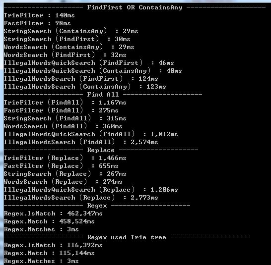

ToolGood.Words
==================
一款高性能非法词(敏感词)检测组件，附带繁体简体互换，支持全角半角互换，获取拼音首字母，获取拼音字母，拼音模糊搜索等功能。

文件夹说明：
```
ToolGood.PinYin.Build:      生成词的拼音
ToolGood.PinYin.WordsBuild: 生成多音词的拼音
ToolGood.Words.Contrast:    字符串搜索对比
ToolGood.Words.Test:        单元测试
ToolGood.Words:             本项目源代码
```


## 繁体简体互换、全角半角互换、数字转成中文大写、拼音操作

``` csharp
    // 转成简体
    WordsHelper.ToSimplifiedChinese("壹佰贰拾叁億肆仟伍佰陆拾柒萬捌仟玖佰零壹元壹角贰分");
    // 转成繁体
    WordsHelper.ToTraditionalChinese("壹佰贰拾叁亿肆仟伍佰陆拾柒万捌仟玖佰零壹元壹角贰分");
    // 转成全角
    WordsHelper.ToSBC("abcABC123");
    // 转成半角
    WordsHelper.ToDBC("ａｂｃＡＢＣ１２３");
    // 数字转成中文大写
    WordsHelper.ToChineseRMB(12345678901.12);
    // 中文转成数字
    WordsHelper.ToNumber("壹佰贰拾叁亿肆仟伍佰陆拾柒万捌仟玖佰零壹元壹角贰分");
    // 获取全拼
    WordsHelper.GetPinYin("我爱中国");//WoAiZhongGuo
    // 获取首字母
    WordsHelper.GetFirstPinYin("我爱中国");//WAZG
    // 获取全部拼音
    WordsHelper.GetAllPinYin('传');//Chuan,Zhuan
``` 

## 拼音模糊搜索
``` csharp
    var text = "阿根廷,澳大利亚,比利时,玻利维亚,巴西,白俄罗斯,加拿大,智利,中国,哥伦比亚,哥斯达黎加,古巴,捷克斯洛伐克,丹麦,多米尼加共和国,厄瓜多尔,埃及,萨尔瓦多,埃塞俄比亚,法国,希腊,危地马拉,海地,洪都拉斯,印度,伊朗,伊拉克,黎巴嫩,利比里亚,卢森堡,墨西哥,荷兰,新西兰,尼加拉瓜,挪威,巴拿马,巴拉圭,秘鲁,菲律宾,波兰,俄罗斯联邦,沙特阿拉伯,南非,阿拉伯叙利亚共和国,土耳其,乌克兰,大不列颠及北爱尔兰联合王国,美利坚合众国,乌拉圭,委内瑞拉,南斯拉夫,阿富汗,冰岛,瑞典,泰国,巴基斯坦,也门,缅甸,以色列,印度尼西亚,阿尔巴尼亚,澳地利,保加利亚,柬埔寨,芬兰,匈牙利,爱尔兰,意大利,约旦,老挝人民民主共和国,罗马利亚,西班牙,斯里兰卡,阿拉伯利比亚民众国,尼泊尔,葡萄牙,日本,摩洛哥,苏丹,突尼斯,加纳,马来西亚,几内亚,贝宁,布基纳法索,喀麦隆,中非共和国,乍得,刚果,科特迪瓦,塞浦路斯,加蓬,马达加斯加,马里,尼日尔,尼日利亚,塞内加尔,索马里,多哥,刚果民主共和国,毛里塔尼亚,蒙古,塞拉利昂,坦桑尼亚联合共和国,阿尔及利亚,布隆迪,牙买加,卢旺达,特立尼达和多巴哥,乌干达,肯尼亚,科威特,马拉维,马耳他,赞比亚,冈比亚,马尔代夫,新加坡,巴巴多斯,博茨瓦纳,圭亚那,莱索托,民主也门,赤道几内亚,毛里求斯,斯威士兰,斐济,巴林,不丹,阿曼,卡塔尔,阿拉伯联合酋长国,巴哈马,德意志联邦共和国,德意志民主共和国,孟加拉国,格林纳达,几内亚比绍,佛得角,科摩罗,莫桑比克,巴布亚新几内亚,圣多美和普林西比多米尼加,所罗门群岛,苏里南,安哥拉,萨摩亚,塞舌尔,吉布提,越南,圣卢西亚,圣文森特和格林纳丁斯,津巴布韦,安提瓜和巴布达,伯利兹,瓦努阿图,圣基茨和尼维斯,文莱达鲁萨兰国,列支敦士登,纳米比亚,朝鲜民主主义人民共和国,爱沙尼亚,密克罗尼西亚联邦,拉脱维亚,立陶宛,马绍尔群岛,大韩民国,亚美尼亚,阿塞拜疆,波斯尼亚和黑塞哥维那,克罗地亚,格鲁吉亚,哈萨克斯坦,吉尔吉斯,摩尔多瓦,圣马力诺,斯洛文尼亚,塔吉克斯坦,土库曼斯坦,乌兹别克斯坦,安道尔,捷克共和国,厄立特里亚,摩纳哥,斯洛伐克共和国,前南斯拉夫的马其顿共和国,帕劳,基里巴斯共和国,瑙鲁,汤加,图瓦卢,南斯拉夫,瑞士,东帝汶";
    PinYinSearch search = new PinYinSearch(PinYinSearchType.PinYin);
    search.SetKeywords(text.Split(',').ToList());

    search.SearchTexts("ad",true);//安道尔,澳大利亚,澳地利
    search.SearchTexts("ad",false);//澳大利亚,澳地利,安道尔
    search.SearchTexts("白e");//白俄罗斯
    search.SearchTexts("baie");//白俄罗斯
    search.SearchTexts("bai俄");//白俄罗斯
```
`PinYinSearch`的方法：`SetKeywords`、`SearchTexts`、`SearchIds`、`SearchTextWithIds`、`PickTexts`、`PickTextWithIds`。

`PinYinSearchEx`是`PinYinSearch`的增强版，优化内存使用量，增加方法`SaveFile`、`LoadFile`。

注：`PinYinSearchEx`测试28W关键字，总字数147W，内存使用量32M，输出文件38M。

## 非法词(敏感词)检测（字符串搜索）
非法词(敏感词)检测类：`StringSearch`、`WordsSearch`、`IllegalWordsSearch`、`IllegalWordsQuickSearch`;

* `StringSearch`: 搜索`FindFirst`方法返回结果为`string`类型。
* `WordsSearch`: 搜索`FindFirst`方法返回结果为`WordsSearchResult`类型,
`WordsSearchResult`不仅仅有关键字，还有关键字的开始位置、结束位置，关键字序号等。
* `IllegalWordsSearch`: 过滤非法词（敏感词）专用类，可设置跳字长度，默认**繁体转简体，全角转半角，忽略大小写，转化特殊数字**，
搜索`FindFirst`方法返回为`IllegalWordsSearchResult`,有关键字，开始位置、结束位置。
* `IllegalWordsQuickSearch`: `IllegalWordsSearch`简化版本。
* `IllegalWordsSearchEx`支持默认**繁体转简体，全角转半角，忽略大小写，转化特殊数字，停顿词，重复词**
* 共同方法有：`SetKeywords`、`ContainsAny`、`FindFirst`、`FindAll`、`Replace`


``` csharp
    string s = "中国|国人|zg人";
    string test = "我是中国人";

    StringSearch iwords = new StringSearch();
    iwords.SetKeywords(s.Split('|'));
    
    var b = iwords.ContainsAny(test);
    Assert.AreEqual(true, b);

    var f = iwords.FindFirst(test);
    Assert.AreEqual("中国", f);

    var all = iwords.FindAll(test);
    Assert.AreEqual("中国", all[0]);
    Assert.AreEqual("国人", all[1]);
    Assert.AreEqual(2, all.Count);

    var str = iwords.Replace(test, '*');
    Assert.AreEqual("我是***", str);
``` 

##### 性能对比
执行10万次性能对比，结果如下：



注:C#自带正则很慢，`StringSearch.ContainsAny`是`Regex.IsMatch`效率的1.5万倍。

`Regex.Matches`的运行方式跟`IQueryable`的类似，只返回`MatchCollection`,还没有计算。

`TrieFilter`,`FastFilter`来源: http://www.cnblogs.com/yeerh/archive/2011/10/20/2219035.html

 在 Find All测试中,

`FastFilter`只能检测出7个:
    [0]: "主席"
    [1]: "赵洪祝"
    [2]: "中国"
    [3]: "铁道部"
    [4]: "党"
    [5]: "胡锦涛"
    [6]: "倒台"

`StringSearch`检测出14个:
    [0]: "党"
    [1]: "党委"
    [2]: "西藏"
    [3]: "党"
    [4]: "党委"
    [5]: "主席"
    [6]: "赵洪祝"
    [7]: "中国"
    [8]: "铁道部"
    [9]: "党"
    [10]: "胡锦涛"
    [11]: "锦涛"
    [12]: "倒台"
    [13]: "黑社会"

`IllegalWordsSearch`检出15个：
    [0]: {63|党}
    [1]: {63|党委}
    [2]: {81|西藏}
    [3]: {83|党}
    [4]: {83|党委}
    [5]: {143|主席}
    [6]: {185|赵洪祝}
    [7]: {204|中国}
    [8]: {221|铁道部}
    [9]: {235|党}
    [10]: {244|胡锦涛}
    [11]: {245|锦涛}
    [12]: {323|倒台}
    [13]: {324|台}
    [14]: {364|黑社会}

`IllegalWordsSearch`比`StringSearch`多一个`台`，原因：关键字繁体转简体

插曲：在细查`Regex.Matches`神奇3ms，我发现`Regex.Matches`有一个小问题，

`Regex.Matches`只能检测出11个:
    [0]: "党"
    [1]: "西藏"
    [2]: "党"
    [3]: "主席"
    [4]: "赵洪祝"
    [5]: "中国"
    [6]: "铁道部"
    [7]: "党"
    [8]: "胡锦涛"
    [9]: "倒台"
    [10]: "黑社会"
