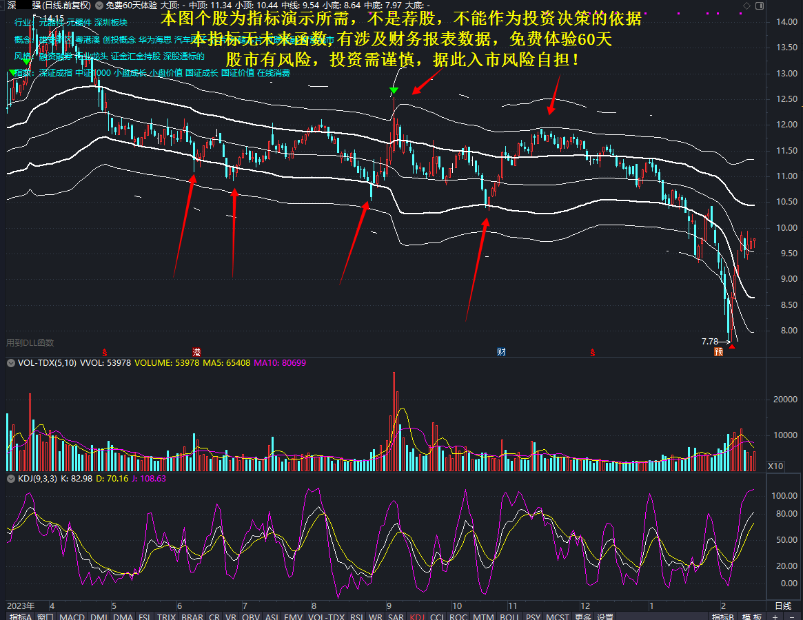
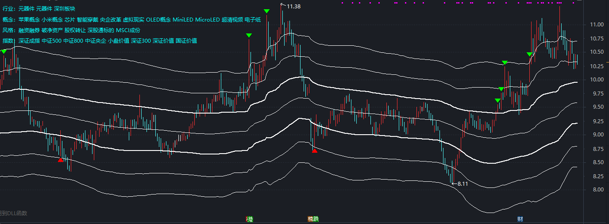
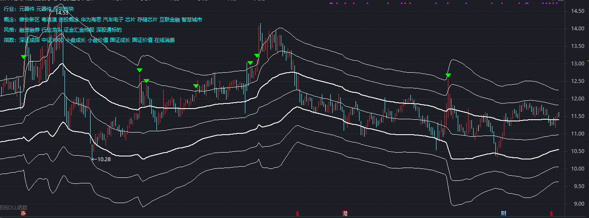
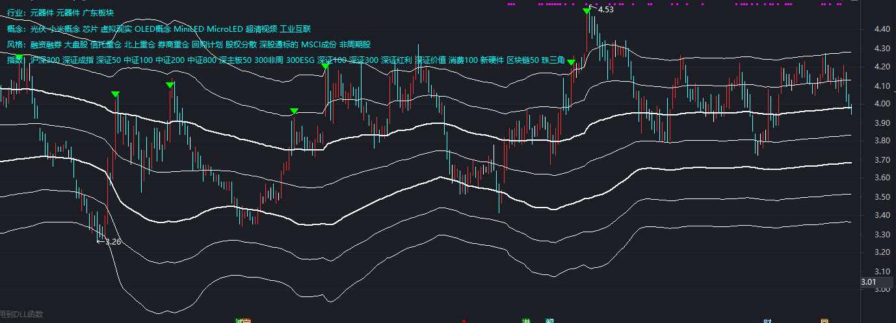
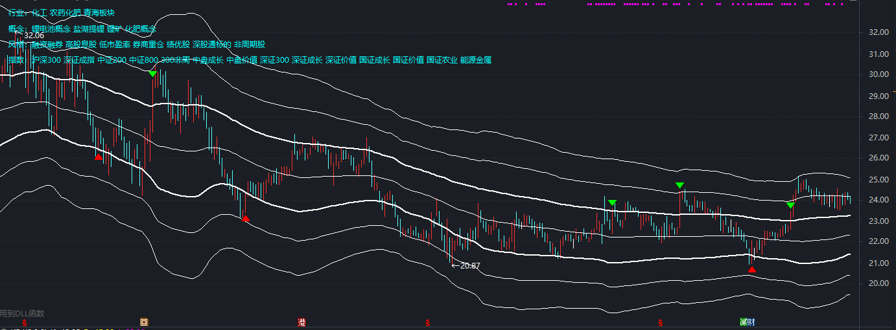

## 支撑压力指标 -- 股票博弈论

很多人喜欢均线指标，依据价格围绕价值上下波动理论，低于均价购入给人一种买值了的感觉。

很多人喜欢BOLL指标，因为BOLL指标基础核心是标准差，标准差是数学中非常可靠的理论。靠近BOLL下轨的股票安全很高。

使用均线、BOLL指标的人思路，他们**投资在乎安全，价格离均价越远，超买超卖，反转机率越高。**

当一个观念深入人心时，就会被利用，如抽取前几日的样本很容易被人为干扰，不符合抽样条件。

股票一个基础概念，交易由买卖双方构成。每个人入股市都是想赚钱的，有人高位卖出，必有人高点买入；有人低位买入，必有人低位割肉卖出，有人赚钱必有人亏钱，这就是博弈。所以**我们进入股市时，应将与市场所有参与者视为对手。**

确立对手后，然后去找一条打败对手的方案。**股票是一个以价格为博弈的战场，谁的成本价底，谁的优势就大。** 所以我们得计算出对手的成本价，**低于对手成本价买入，这样就有成本优势了。**

有了成本优势，下一步我们应将成本优势最大化，**底部拐点是最好的买点。**

思考一下为何有拐点，拐点意味什么？

**我的猜测，拐点是主力成本价（或预设底价），当价格低于主力成本价时，主力是不会让散户捡到廉价的筹码，所以会产生支撑。**

到此处，我们有了两个价格，一个对手的成本价，一个主力的成本价。

采用BOLL指标上下轨模式，结合中国股市牛短熊长特征和博弈论思想，设定如下：
* 1、上轨设为对手的成本价。由于对手众多，只能算均价。均价不是均线，均价可以通过算法累计股价和成交量算出。
* 2、下轨设为主力的成本价。庄家不会让散户捡到廉价的筹码。通过算法累计最低价，可以计算出庄家的成本价。
* 3、中轨=（上轨+下轨）/2。
* 4、上轨上方还要设置两轨。由于上轨为对手的均价，技术差的散户成本价在上轨的上方。
* 5、下轨下方也要设置两轨。当行情不好时，庄家不会为行情兜底，割血的筹码才是他们想要的。

为了方便好记，将7条轨道重新命名，从上到下依次是：大顶、中顶、小顶、中线、小底、中底、大底。

中国股市牛短熊长，所以对于多数个股趋势判断非常有效。

数据统计证明：2022年7月至2023年10月中旬，沪深A股，交易日大于250天，总共4779只，4126只股票能复现买入卖出点，占86.34%。

**缺点，小顶采用的是对手均价，牛市时无法准确判断顶部，无法判断连续涨停的股票。**
本指标是一个短线指标。

以下是好指标评判标准，总记100分：
* 1、指标不能有未来函数；(10分)
* 2、指标设计原理要有可靠的底层逻辑，并能阐述其不足之处；(20分)
* 3、指标能够反馈出经济（股价）规律，如价格与价值关系，价格围绕价值上下波动；(20分)
* 4、指标简单，清晰可见，能看股价趋势，上升高弱；(20分)
* 5、指标有能够预判顶部和底部，有数据统计支撑，成功率在85%以上；(20分)
* 6、指标符合自己的操作习惯，补足自身缺点；(10分)

我的评分是85分
* 1、无未来函数，10分
* 2、有可行的底层逻辑，并且能知晓不足，20分
* 3、指标够反馈出股价规律，20分
* 4、指标最多7条线，清晰可见，能看股价趋势，15分
* 5、对一些牛股、连板股无法预测顶部，但有数据统计支撑，15分
* 6、实战中指标还需要结合大行情、成交量、筹码等指标，5分

------------------------
出售阻力支撑指标，398元一年，998元三年，10000元永久。

阻力支撑指标无未来函数,有涉及财务报表数据，免费体验60天。

无丰富交易经验人员勿买。

百度网盘下载：https://pan.baidu.com/s/13IkFYcnOuu_jpvpEaf_7gA?pwd=d6qc

网址：https://stock.toolgood.com

------------------------

